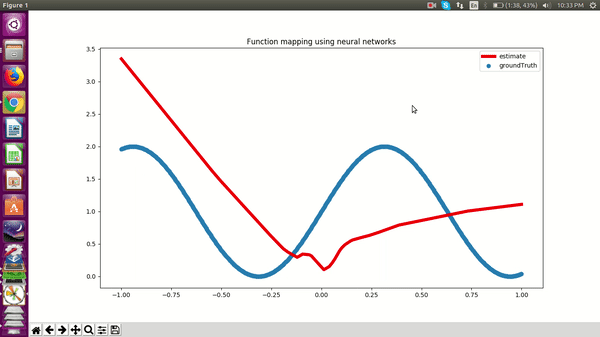

# Function mapping using a neural network with a single hidden layer

This repository contains code for my experimentation with the expressivity of neural networks with a single hidden layer. 

Note: To simulate real world feel I have added Gaussian noise with mean=0 and standard deviation of 0.1

## Requirement
- Python 2.7+ or 3.5+.
- [Tensorflow](https://www.tensorflow.org/) and its requirements. I use the pip tensorflow-gpu==1.6.0
- [NumPy](http://www.numpy.org/). The pip should work.
- [Matplotlib](http://www.matplotlib.org/). The pip should work.

## Usage
```
python neural_net_funcmappimg.py func_name
```
*func_name* can be sine,cube,square

## License
[MIT](https://choosealicense.com/licenses/mit/)
